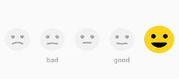

SmileyRatingBar
===============
[  ](https://bintray.com/vaibhavbhandula/Maven/SmileyRatingBar/_latestVersion) [](LICENSE) [](https://travis-ci.org/vaibhavbhandula/SmileyRatingBar)

Smiley Rating Bar for Android



Download
--------

Maven:
```xml
<dependency>
    <groupId>com.rating.smileyratingbar</groupId>
    <artifactId>smileyratingbar</artifactId>
    <version>1.0.0</version>
    <type>pom</type>
</dependency>
```
or Gradle:
```groovy
implementation 'com.rating.smileyratingbar:smileyratingbar:1.0.0'
```
Usage
-----

```xml
<com.rating.smileyratingbar.SmileyRatingBar
    android:id="@+id/smiley_rating"
    android:layout_width="wrap_content"
    android:layout_height="wrap_content"
    android:layout_centerInParent="true"
    android:layout_gravity="center"
    android:gravity="center" />
```

To set Name for emoji

```kotlin
smiley_rating?.setNameForEmoji(SmileyRatingBar.Rating.GOOD, "good")
```

To set Typeface for text

```kotlin
smiley_rating?.setTypeface(Typeface.SERIF)
```

To get rating for the emoji
```kotlin
smiley_rating?.setRatingSelectListener(this)
```

There is an example which shows the usage

License
-------

    Licensed under the Apache License, Version 2.0 (the "License");
    you may not use this file except in compliance with the License.
    You may obtain a copy of the License at

       http://www.apache.org/licenses/LICENSE-2.0

    Unless required by applicable law or agreed to in writing, software
    distributed under the License is distributed on an "AS IS" BASIS,
    WITHOUT WARRANTIES OR CONDITIONS OF ANY KIND, either express or implied.
    See the License for the specific language governing permissions and
    limitations under the License.
